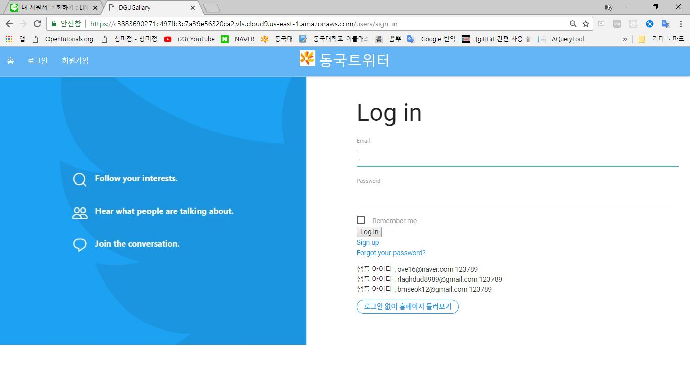
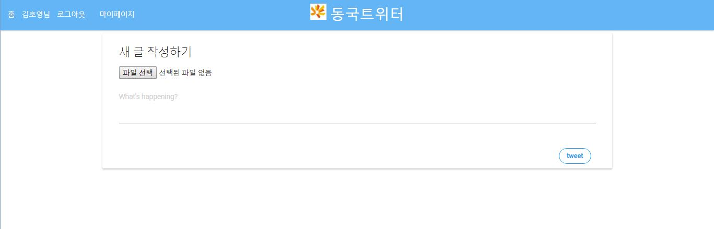
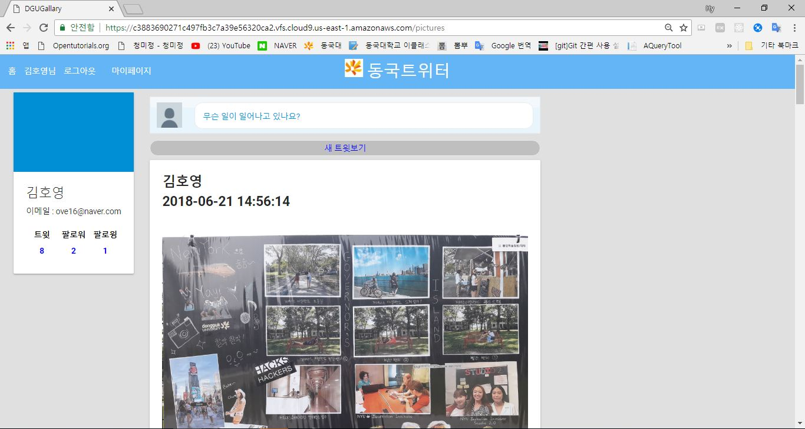

# tweetsogong

------------------------------------------------------------------------------------------------------------------------------------------
2018-1 소프트웨어 공학및설계 수업시간에 진행한 동국SNS만들기 

프로젝트명 : tweetsogong   
소프트웨어 : Ruby on Rails 5  
설명 : 팔로우 기능이 추가된 SNS입니다. 유튜브 플러리 영상을 보고 학습하며 만들었습니다. 

<그림1 : 로그인 및 회원가입>

<그림2 : 글쓰기>

<그림3 : 홈>

